# Workflow

---

Create a codespace:

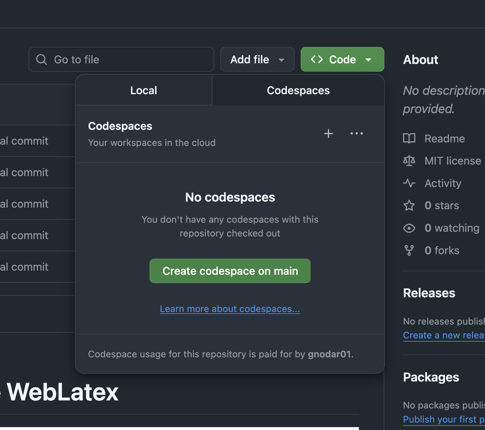

---

Open it in your local (or wherever) VS Code:

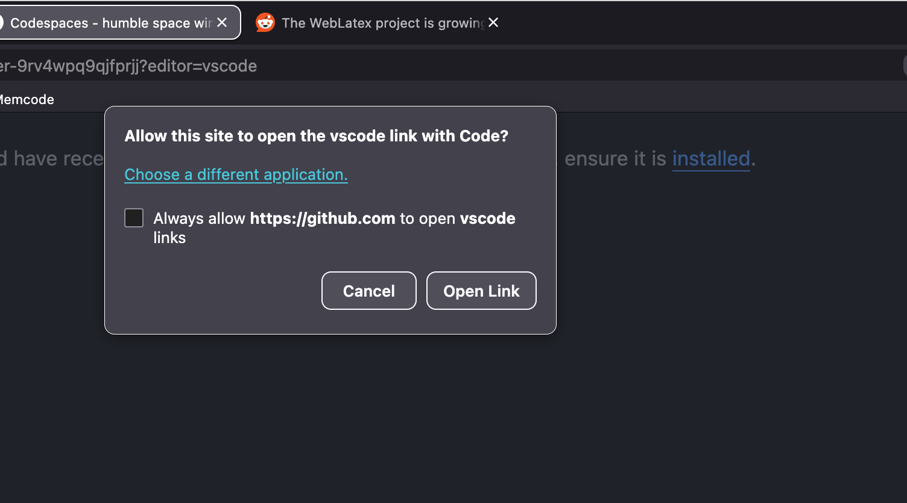

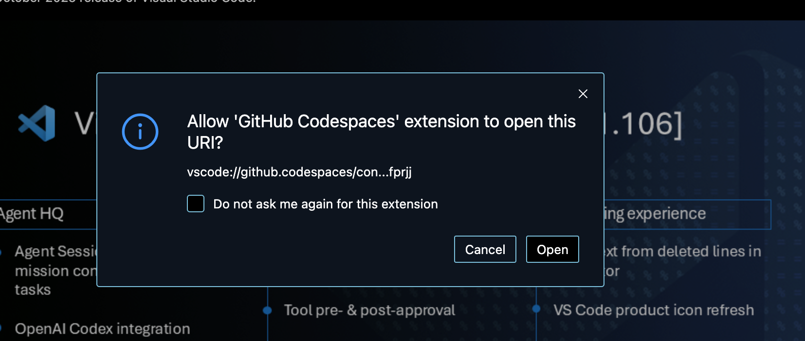

---

Authenticate using GitHub (along with using Github's rather granular access control mechanisms):

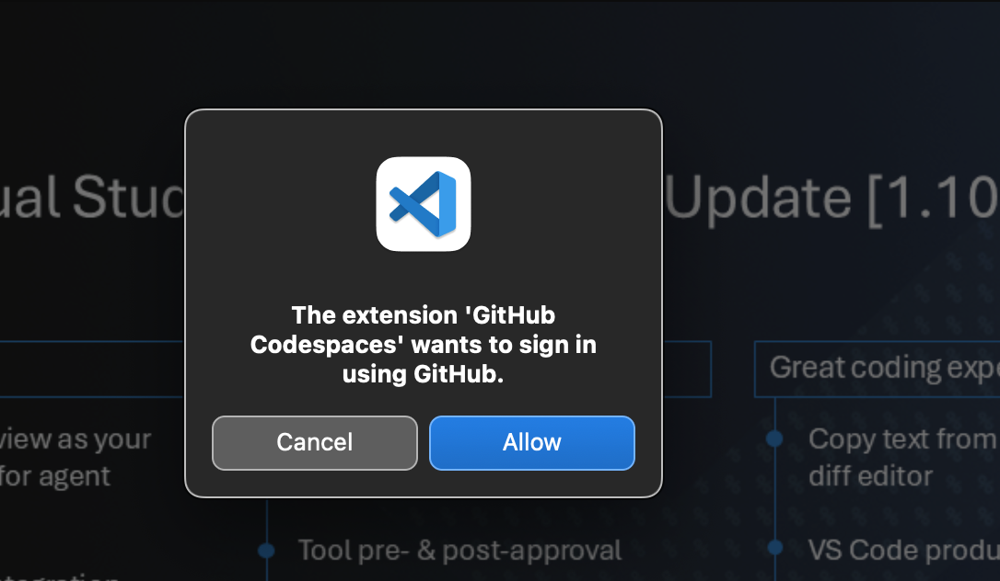

---

Initialize the devcontainer, which has the extensions preinstalled for you (along with your own local extensions):

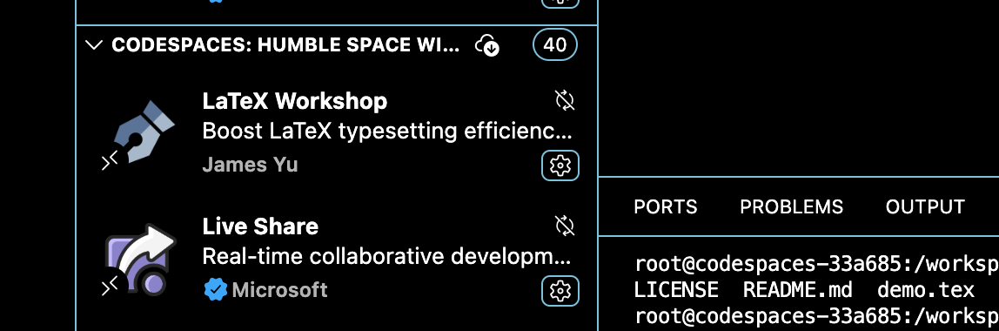

---

Author your latex documents, get auto-compiling, synced rendering, etc.:

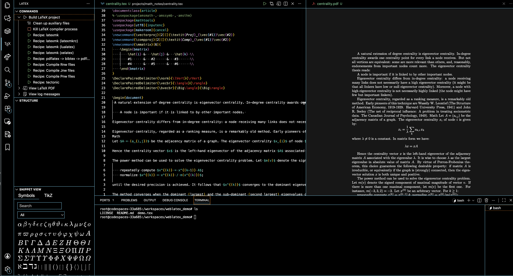

---

Version control the document using git. It's just git, so automate/script it however you want. For example, watch for changes and auto-commit on save or auto-commit on re-render, or every 5 minutes, etc.

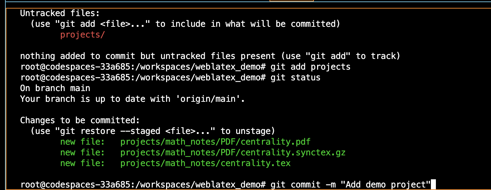

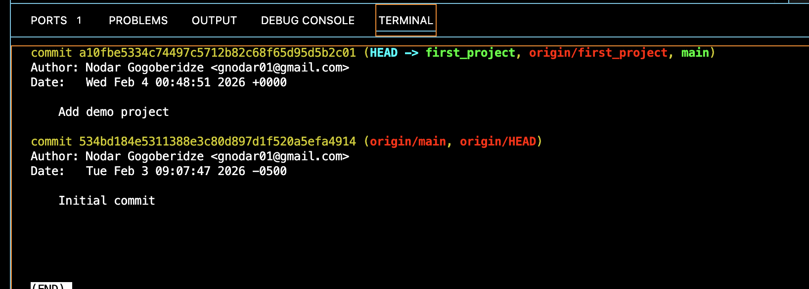

---

Host discussions using the normal PR process. Open a PR:

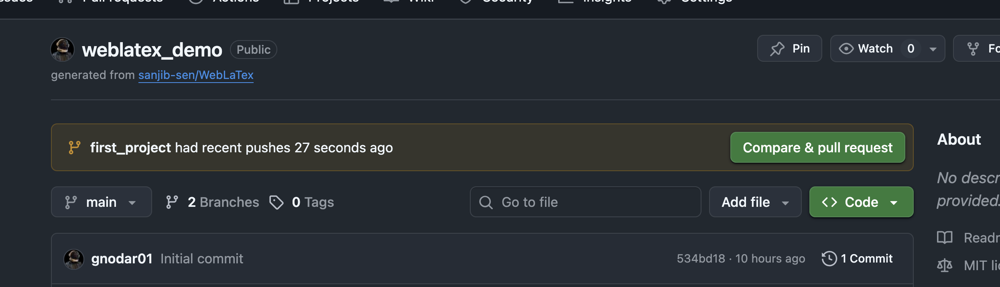

---

Google docs style, multicursor, CRDT, with live sharing. Hop on a zoom call and edit with whoever:

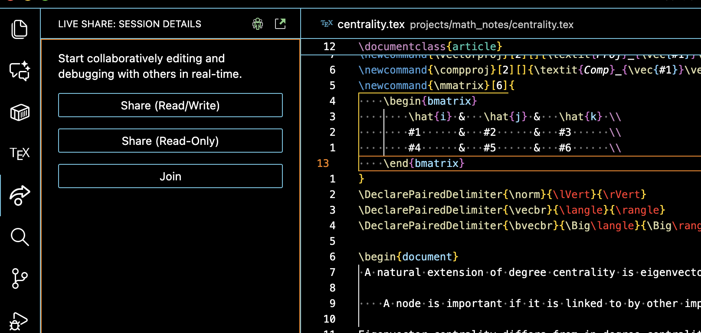

---

Add comments in VS Code using Github PR Review extension:

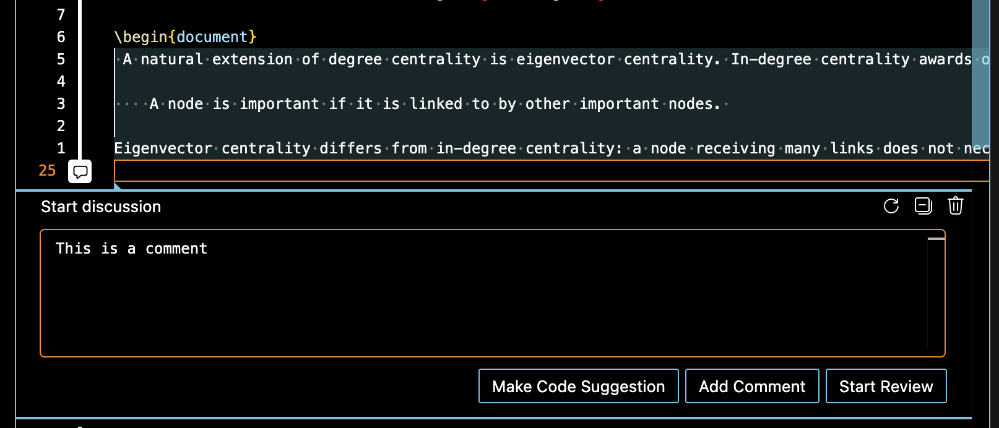

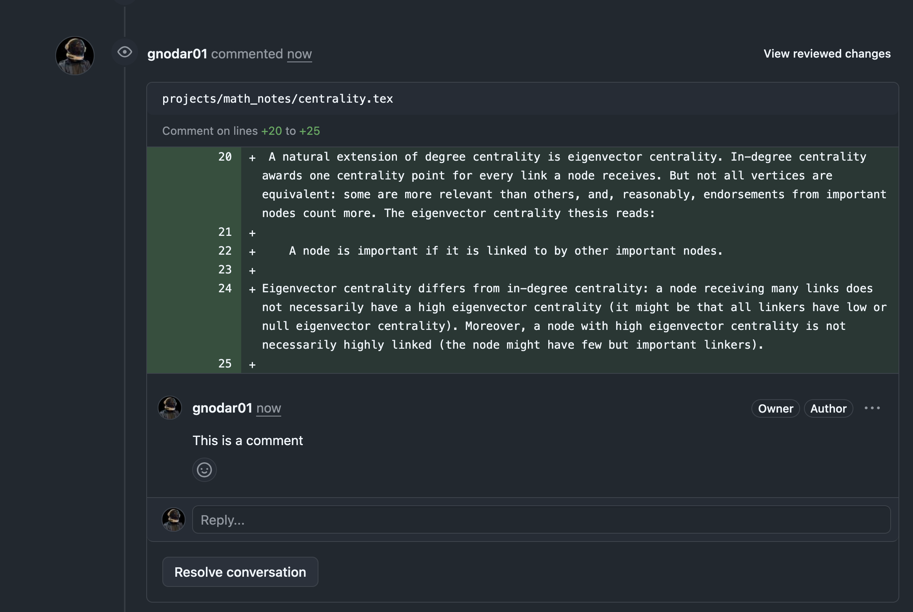

---

Don't want to use a locally installed VS Code, use VS Code in the browser:

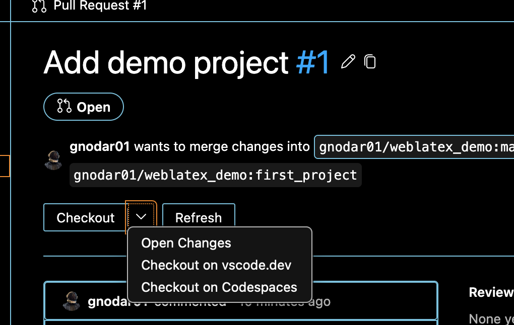

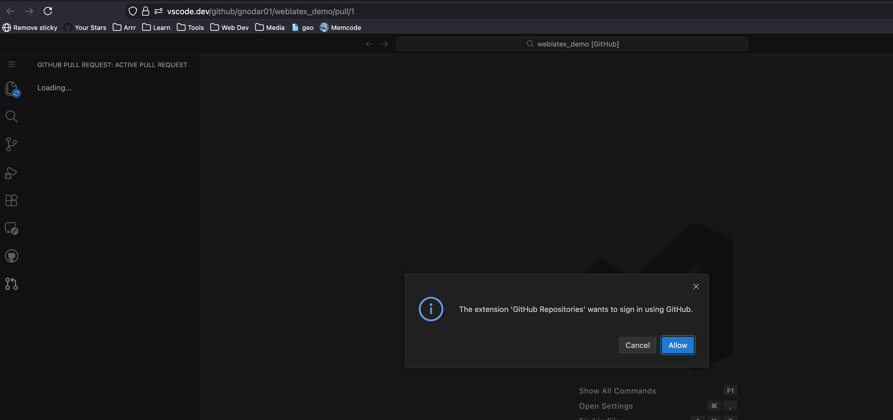

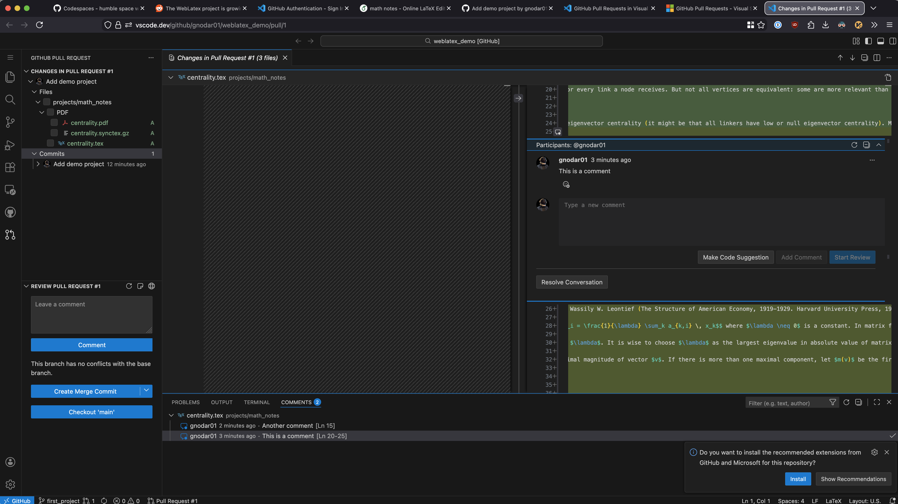
